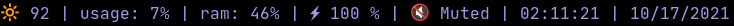

# go-dwm-statusbar

Fast and lightweight status bar for the dwm window manager on Linux X11 desktops.




### Modules:
- Date
- Time
- Battery
- Brightness
- CPU Usage
- Memory Usage
- MPRIS (Media playback status)
- Pulseaudo Volume Status

### Download
```
git clone https://github.com/atar13/go-dwm-statusbar.git
```

### Install 

```
cd go-dwm-statusbar
make build
sudo make install
```

### Configuration

Edit or create a config file at ```$HOME/.config/go-dwm-statusbar/config.yaml```

Full description of configuration options can be found in the [```config-sample.yaml```](./config-sample.yaml) file
